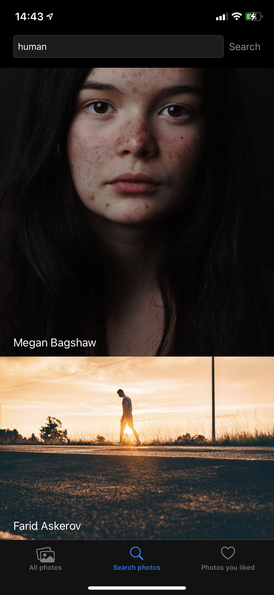

# Splashpaper
## Introduction
This app uses the Unsplash API to deliver awesome wallpapers to the end user. This project is an example of using third party APIs in Swift that showed me how to handle http requests from the build in libraries. Splashpaper can also store what photos you liked without signing with your unsplash account - simply by local storing the IDs oh those pictures. I know tah this method is incorrect with the API documentation but i wanted to try it out using Cora Data (:

## Technologies
Splashpaper was written for iOS in Swift using the UIKit framework. The UI was mostly made in storyboard but some functionality was added in the viewcontrollers code as well. The information of liked photos is stored localy on the device using a simple CoraData model which contains a string with the photos ID. If you want to add some more functionality to this project feel free to clone my repo, than read the Unsplash API documentation (@ https://unsplash.com/documentation) and implement your changes (:

## Ilustrations
The main screen of the app shows the newest photos on Unsplash with a small annotation who's the author. The display list was done using a table view.

   

The search view was made as like the main screen with an additional search bar where the user can write a query phrase. In fact the main screen uses the same mechanism with a constant query "new".

   

Tapping an image in any of the views shows a detail view of the selected photo. The detail view is a popup view which contains a "Like" and "Download" button. In a future release i want to add a photo description somewhere in this view. A downloaded photo will be saved to the users camera roll.

   

The "Liked photo" view fetch the local data that containt IDs of the liked photos and than it send a request do get this particular images (it's a little bit different than in the API documentation but allows to like a photo without having a Unsplsh account). The getted photos a presented aslo in a table view.

   

